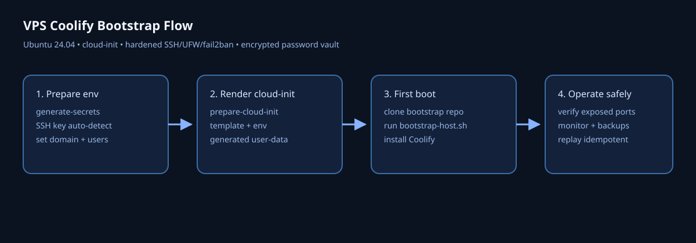

# VPS Coolify Bootstrap

[](https://github.com/rigu/vps-coolify-bootstrap/actions/workflows/ci.yml)
[](https://github.com/rigu/vps-coolify-bootstrap/actions/workflows/pages.yml)
[](LICENSE)
[](https://github.com/rigu/vps-coolify-bootstrap/releases)
[](https://github.com/rigu/vps-coolify-bootstrap/commits/main)

Production-ready **VPS bootstrap for Coolify on Ubuntu 24.04 LTS** with VPS-Coolify init user-data, SSH hardening, UFW baseline, fail2ban, unattended upgrades, user password vault encryption, and replay-safe bootstrap scripts.



## Why this repo

- secure-by-default baseline for first boot
- reproducible VPS-Coolify init rendering from env templates
- Linux/macOS + PowerShell support for operators
- explicit recovery runbook for failed first boot
- public/generic templates with no private data

## Quick Start

Prerequisites: Git, Bash (or PowerShell), OpenSSL, and a VPS provider account.

1. Prepare env + secrets:
```bash
mkdir -p bootstrap-artifacts
cp env/bootstrap.env.example bootstrap-artifacts/bootstrap.env
bash scripts/generate-secrets.sh --env-file bootstrap-artifacts/bootstrap.env
```
2. Generate VPS-Coolify init file:
```bash
bash scripts/prepare-vps-coolify-init.sh --env-file bootstrap-artifacts/bootstrap.env --overwrite
```
3. Provision VPS by pasting `bootstrap-artifacts/vps-coolify-init.generated.yml` into the provider user-data/cloud-init field during server creation (first boot). If the UI has no user-data option, use provider API/CLI or follow the manual fallback in [docs/getting-started.md](docs/getting-started.md#3-provision-vps).

## Documentation (GitHub Pages)

Canonical instructions were moved to GitHub Pages docs:

- Site: `https://rigu.github.io/vps-coolify-bootstrap/`
- Local source: [docs/index.md](docs/index.md)
- Getting started: [docs/getting-started.md](docs/getting-started.md)
- Bootstrap flow: [docs/bootstrap-flow.md](docs/bootstrap-flow.md)
- Coolify deployment modes: [docs/coolify-deployment-modes.md](docs/coolify-deployment-modes.md)
- Operations and security: [docs/operations-security.md](docs/operations-security.md)
- Failure recovery: [docs/bootstrap-failure-recovery.md](docs/bootstrap-failure-recovery.md)
- GitHub promotion checklist: [docs/github-promotion.md](docs/github-promotion.md)

## Ubuntu Target

This bootstrap is adapted for **Ubuntu 24.04 LTS**.

## Disclaimer

These scripts and templates are provided for operational convenience and must be used at your own risk. You are solely responsible for validating configuration, security hardening, compliance, backups, and production suitability in your environment. The author and contributors are not liable for any direct, indirect, incidental, or consequential damages, data loss, downtime, security incidents, or other consequences resulting from use of this repository.

## License

This project is licensed under the MIT License. See [LICENSE](LICENSE).
