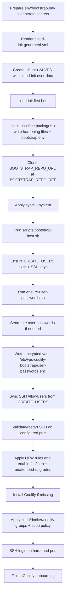

# VPS Coolify Bootstrap

Public generic bootstrap kit for production VPS provisioning with Coolify.

This repository includes:
- generic instructions and runbooks (`README.md`, `docs/`)
- env templates (`env/`)
- bootstrap and helper scripts (`scripts/`, Bash + PowerShell)
- a generic cloud-init template (`templates/cloud-init.template.yml`)

## Ubuntu Target

This bootstrap is adapted for **Ubuntu 24.04 LTS** servers.
Runbooks, package assumptions, service names, and hardening steps are written for Ubuntu 24.

## What The YAML File Does

`scripts/prepare-cloud-init.sh` or `scripts/prepare-cloud-init.ps1` renders
`cloud-init.generated.yml` from `templates/cloud-init.template.yml` and your
`env/bootstrap.env`.

Exactly what `cloud-init.generated.yml` does on first boot:

1. Sets timezone and runs `package_update` + `package_upgrade`.
2. Creates two initial sudo users (`PRIMARY_SUDO_USER`, `SECONDARY_SUDO_USER`)
   and installs their SSH public key.
3. Disables root login and password authentication for SSH.
4. Installs baseline packages:
   `ca-certificates`, `curl`, `git`, `openssl`, `python3`, `ufw`, `fail2ban`,
   `unattended-upgrades`.
5. Writes kernel/network hardening config:
   - `/etc/sysctl.d/99-hardening.conf`:
     `rp_filter`, no ICMP redirects, no source-route acceptance, TCP syncookies.
6. Writes SSH/fail2ban/bootstrap runtime config:
   - `/etc/systemd/system/ssh.socket.d/override.conf` (custom SSH port)
   - `/etc/ssh/sshd_config.d/10-bootstrap-hardening.conf` (SSH hardening)
   - `/etc/fail2ban/jail.d/10-bootstrap-sshd.local` (fail2ban for SSH with progressive banning, max 7d)
   - `/etc/vps-coolify-bootstrap/bootstrap.env` (runtime bootstrap variables)
7. In `runcmd`, applies kernel settings via `sysctl --system`.
8. In `runcmd`, clones `BOOTSTRAP_REPO_URL` at `BOOTSTRAP_REPO_REF` into
   `/opt/vps-coolify-bootstrap`.
9. Executes `/opt/vps-coolify-bootstrap/scripts/bootstrap-host.sh` with
   `/etc/vps-coolify-bootstrap/bootstrap.env`.

Then `bootstrap-host.sh` continues with operational setup (user/group policy,
firewall, fail2ban/unattended upgrades enablement, Coolify install, encrypted
user-password vault generation).

`bootstrap-host.sh` also:
- syncs SSH `AllowUsers` to all users from `CREATE_USERS`
- writes sudo policy so only `PRIMARY_SUDO_USER` stays passwordless by default

## 1) Prepare env values

Linux/macOS:

```bash
cp env/bootstrap.env.example env/bootstrap.env
bash scripts/generate-secrets.sh --env-file env/bootstrap.env
```

Windows PowerShell:

```powershell
Copy-Item env/bootstrap.env.example env/bootstrap.env
pwsh -File scripts/generate-secrets.ps1 -EnvFile env/bootstrap.env
```

Generate-secrets scripts auto-detect the current user SSH public key and fill
`SSH_PUBLIC_KEY` when it is empty or still `CHANGE_ME`.

Then edit `env/bootstrap.env` and set:
- SSH key (`SSH_PUBLIC_KEY` or `SSH_PUBLIC_KEY_PATH`)
- SSH key rotation mode (`SSH_KEY_ROTATE`, `0` append / `1` replace)
- public Coolify domain (`COOLIFY_PUBLIC_DOMAIN`)
- Coolify root credentials
- encryption password for user credential vault (`USER_PASSWORDS_ENCRYPTION_PASSWORD`)
- user/group policy lists
- bootstrap source URL only if you need a fork/mirror (`BOOTSTRAP_REPO_URL`)
- bootstrap source branch/tag if needed (`BOOTSTRAP_REPO_REF`)

Default `BOOTSTRAP_REPO_URL` points to this public repository:
`https://github.com/rigu/vps-coolify-bootstrap.git`.

## User and Group Policy

`env/bootstrap.env.example` includes explicit policy lists:
- `CREATE_USERS`
- `SUDO_USERS`
- `DOCKER_USERS`
- `COOLIFY_GROUP_USERS`

Default values are `deploy,coolify`.

Bootstrap user creation is driven by:
- `PRIMARY_SUDO_USER`
- `SECONDARY_SUDO_USER`

Keep these aligned with the policy lists.

## More Than 2 Sudo Users

Use comma-separated lists in `env/bootstrap.env` (no spaces):

```env
PRIMARY_SUDO_USER=deploy
SECONDARY_SUDO_USER=coolify

CREATE_USERS=deploy,coolify,admin,ops,dev
SUDO_USERS=deploy,coolify,admin,ops,dev
DOCKER_USERS=deploy,coolify,ops
COOLIFY_GROUP_USERS=deploy,coolify,ops
```

Then regenerate cloud-init:

```bash
bash scripts/prepare-cloud-init.sh --env-file env/bootstrap.env --overwrite
```

For an already provisioned server, reapply the bootstrap policy:

```bash
sudo bash /opt/vps-coolify-bootstrap/scripts/bootstrap-host.sh /etc/vps-coolify-bootstrap/bootstrap.env
```

`bootstrap-host.sh` updates SSH `AllowUsers` automatically from `CREATE_USERS`,
so additional users can SSH without manual edits to
`/etc/ssh/sshd_config.d/10-bootstrap-hardening.conf`.

`bootstrap-host.sh` resets UFW to the bootstrap baseline on every run.
If you added custom firewall rules manually, re-apply them after each replay.

When users from `CREATE_USERS` are created with locked/no password, bootstrap will:
- generate strong per-user passwords
- set those passwords on the server accounts
- save credentials encrypted at `/etc/vps-coolify-bootstrap/user-passwords.enc`

If a `CREATE_USERS` account has no recoverable entry in the encrypted file,
bootstrap rotates that account password and refreshes the encrypted file.

By default SSH keys are appended (`SSH_KEY_ROTATE=0`). Set `SSH_KEY_ROTATE=1`
to replace each managed user's `authorized_keys` with the current
`SSH_PUBLIC_KEY` during bootstrap replay.

## 2) Generate cloud-init

Linux/macOS:

```bash
bash scripts/prepare-cloud-init.sh --env-file env/bootstrap.env --overwrite
```

PowerShell:

```powershell
pwsh -File scripts/prepare-cloud-init.ps1 -EnvFile env/bootstrap.env -Overwrite
```

Generated output defaults to `cloud-init.generated.yml`.

## 3) Provision VPS

Use `cloud-init.generated.yml` as user-data in your VPS provider.

At first boot, cloud-init clones `BOOTSTRAP_REPO_URL` at `BOOTSTRAP_REPO_REF` and runs:
- `scripts/bootstrap-host.sh`

That keeps cloud-init small and centralizes operational logic in public scripts.

After first boot:
- connect using the configured SSH port (default `2278`)
- open `https://<COOLIFY_PUBLIC_DOMAIN>` and finish Coolify onboarding in browser
- deploy project-specific stacks from your private/project repos

## Bootstrap Flow



First-boot execution order (source of truth):
1. `cloud-init.generated.yml` runs package update/upgrade and writes:
   - `/etc/sysctl.d/99-hardening.conf`
   - SSH hardening files
   - fail2ban jail file (with progressive ban settings)
   - `/etc/vps-coolify-bootstrap/bootstrap.env`
2. Cloud-init clones the bootstrap repo from `BOOTSTRAP_REPO_URL` at `BOOTSTRAP_REPO_REF`.
3. Cloud-init applies kernel settings with `sysctl --system`.
4. Cloud-init runs `scripts/bootstrap-host.sh /etc/vps-coolify-bootstrap/bootstrap.env`.
5. `bootstrap-host.sh` ensures users + SSH keys from `CREATE_USERS`.
6. `bootstrap-host.sh` runs `scripts/ensure-user-passwords.sh`:
   - generates/rotates account passwords when needed
   - updates encrypted credential vault at `/etc/vps-coolify-bootstrap/user-passwords.enc`
7. `bootstrap-host.sh` syncs SSH `AllowUsers` with the full `CREATE_USERS` list.
8. `bootstrap-host.sh` validates/restarts SSH, applies firewall rules, enables fail2ban/unattended-upgrades.
9. `bootstrap-host.sh` installs Coolify when not already running.
10. `bootstrap-host.sh` applies sudo/docker/coolify group memberships and sudo policy.

The bootstrap prints the expected Coolify URL as:
`https://<COOLIFY_PUBLIC_DOMAIN>`.

## Failure Recovery

If first boot fails, use the dedicated runbook:
- [docs/bootstrap-failure-recovery.md](docs/bootstrap-failure-recovery.md)

Quick recovery sequence:

1. Confirm failure state:
```bash
sudo cloud-init status --wait
sudo cloud-init status --long
```
2. Inspect logs:
```bash
sudo tail -n 250 /var/log/cloud-init-output.log
sudo journalctl -u cloud-init -u cloud-config -u cloud-final --no-pager -n 250
```
3. Replay bootstrap:
```bash
sudo bash /opt/vps-coolify-bootstrap/scripts/bootstrap-host.sh /etc/vps-coolify-bootstrap/bootstrap.env
```
4. Validate services and firewall:
```bash
sudo systemctl is-active ssh.socket ssh fail2ban unattended-upgrades
sudo ufw status verbose
sudo docker ps --format 'table {{.Names}}\t{{.Status}}'
```

For full recovery (including missing repo/env rebuild and clean reprovision path), follow all steps in `docs/bootstrap-failure-recovery.md`.

To decrypt generated user credentials on the server:

```bash
export USER_PASSWORDS_ENCRYPTION_PASSWORD="<value-from-bootstrap.env>"
sudo openssl enc -d -aes-256-cbc -pbkdf2 -iter 200000 \
  -in /etc/vps-coolify-bootstrap/user-passwords.enc \
  -pass env:USER_PASSWORDS_ENCRYPTION_PASSWORD
```

## Post-Onboarding Security (Required)

Docker-published ports can bypass UFW because Docker writes iptables rules
directly. Do not assume UFW alone blocks container `-p host:container`
exposure.

After onboarding, verify exposed ports:

```bash
sudo ss -tulpen
sudo docker ps --format 'table {{.Names}}\t{{.Ports}}'
```

Pay special attention to Coolify internal ports `6001` and `6002`; they should
not be publicly exposed unless explicitly required.

Mitigation options (with trade-offs):
- restrict access via explicit `DOCKER-USER` chain rules
- use `ufw-docker` policy management
- set Docker `"iptables": false` only if you fully manage equivalent firewall rules

## Recommended Traefik Security Headers

For production apps behind Coolify/Traefik, apply middleware for at least:
- `Strict-Transport-Security` (HSTS)
- `X-Content-Type-Options: nosniff`
- `X-Frame-Options` (or CSP `frame-ancestors`)
- `Referrer-Policy`
- `Content-Security-Policy` (app-specific)

## Coolify Update Strategy

Coolify may auto-update. For production workloads, prefer controlled updates:
- disable auto-updates in Coolify settings
- schedule upgrades in maintenance windows
- validate backup and rollback paths before upgrades

## Post-Bootstrap Monitoring

Minimum recommended checks:
- disk usage and inode alerts
- memory pressure / OOM events
- container health and restart loops
- TLS certificate expiry
- backup job success verification

At minimum, run periodic checks with alerting (email/webhook).

## Logging And Retention

Cloud-init and Docker logs can grow over time. Configure Docker log retention
(for example `json-file` with `max-size` and `max-file`) and verify host
logrotate policy.

## Notes

- Minimum Coolify root password length enforced: 16 chars.
- Generated cloud-init is validated against Hetzner's 32 KiB user-data limit.
- Default bootstrap users are `deploy` and `coolify`.
- `cloud-init.generated.yml` contains secrets and must never be committed.
