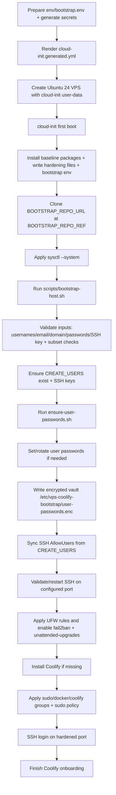

# Bootstrap Flow

## What the cloud-init YAML does

`prepare-cloud-init.sh` or `prepare-cloud-init.ps1` renders `cloud-init.generated.yml` from:

- `templates/cloud-init.template.yml`
- `env/bootstrap.env`

On first boot, cloud-init:

1. sets timezone and runs package update/upgrade
2. creates initial users (`PRIMARY_SUDO_USER`, `SECONDARY_SUDO_USER`) and SSH key
3. disables root SSH login and SSH password auth
4. installs baseline packages (`curl`, `git`, `openssl`, `ufw`, `fail2ban`, `unattended-upgrades`, ...)
5. writes hardening and runtime files
6. clones bootstrap repo at selected URL/ref
7. applies `sysctl --system`
8. runs `scripts/bootstrap-host.sh`

## First-boot execution order



## Runtime outputs

- Coolify URL printed by bootstrap:
  - `https://<COOLIFY_PUBLIC_DOMAIN>`
- encrypted credential vault:
  - `/etc/vps-coolify-bootstrap/user-passwords.enc`

To decrypt on server:

```bash
export USER_PASSWORDS_ENCRYPTION_PASSWORD="<value-from-bootstrap.env>"
sudo openssl enc -d -aes-256-cbc -pbkdf2 -iter 200000 \
  -in /etc/vps-coolify-bootstrap/user-passwords.enc \
  -pass env:USER_PASSWORDS_ENCRYPTION_PASSWORD
```

Back to [Docs Home](index.md)
