---
---

# Bootstrap Flow

## What the VPS-Coolify init YAML does

`prepare-vps-coolify-init.sh` or `prepare-vps-coolify-init.ps1` renders
`bootstrap-artifacts/vps-coolify-init.generated.yml` from:

- `templates/vps-init.template.yml` (VPS init template)
- `bootstrap-artifacts/bootstrap.env`

On first boot, the VPS init agent:

1. sets the timezone and runs package update/upgrade
2. creates initial users (`DEVOPS_USER`, `COOLIFY_SUDO_NOPASSWD_USER`) and sets SSH bootstrap key for `DEVOPS_USER`
   (additional users from `ADDITIONAL_SUDO_USERS` are created later by `bootstrap-host.sh`)
3. disables root SSH login and SSH password auth
4. installs baseline packages (`curl`, `git`, `openssl`, `ufw`, `fail2ban`, `unattended-upgrades`, ...)
5. writes hardening and runtime files
6. clones bootstrap repo at selected URL/ref
7. applies `sysctl --system`
8. runs `scripts/bootstrap-host.sh`

## First-boot execution order

```mermaid
flowchart TD
  A["Prepare env + secrets"] --> B["Render VPS-Coolify init"]
  B --> C["Provision Ubuntu 24 VPS"]
  C --> D["VPS first boot: run VPS init user-data"]
  D --> E["Install packages + write baseline files"]
  E --> F["Clone BOOTSTRAP_REPO_URL at BOOTSTRAP_REPO_REF"]
  F --> G["Apply kernel/network sysctl profile (sysctl --system)"]
  G --> H["Run scripts/bootstrap-host.sh"]
  H --> H1["Re-validate runtime inputs on VPS"]
  H1 --> I["Ensure users + SSH keys (including COOLIFY_SUDO_NOPASSWD_USER)"]
  I --> J["Run ensure-user-passwords.sh"]
  J --> K["Set passwords for locked/unset users or users missing from vault"]
  K --> L["Write encrypted vault /etc/vps-coolify-bootstrap/user-passwords.enc"]
  L --> M["Sync SSH AllowUsers from effective managed users"]
  M --> N["Disable ssh.socket, disable legacy Port directives, validate sshd, restart ssh.service, enforce only SSH_PORT (no :22 listener)"]
  N --> O["Apply UFW rules and enable fail2ban + unattended-upgrades"]
  O --> P["Install Coolify if missing"]
  P --> P1["Ensure Coolify root account exists (RootUserSeeder + DB check)"]
  P1 --> R["Apply groups + sudo policy"]
  R --> Q["Sync localhost-only Coolify SSH user + restricted key + SSH port"]
  Q --> Q1["Sync realtime host env from effective realtime domain (COOLIFY_REALTIME_DOMAIN or COOLIFY_PUBLIC_DOMAIN fallback)"]
  Q1 --> S["Sync DOCKER-USER guards for 6001/6002 from CLOSE_COOLIFY_REALTIME_PORTS"]
  S --> T["SSH login on hardened port"]
  T --> U["Finish Coolify onboarding"]
```



Important: `ensure-user-passwords.sh` runs on the VPS host during bootstrap/replay.
User account passwords are not pre-generated locally during env preparation.

## Why validation appears twice

Validation is intentionally done in two stages:

1. local render validation (`prepare-vps-coolify-init.*`) before generating the YAML
2. server runtime validation (`bootstrap-host.sh`) before applying privileged changes

This is defense-in-depth. Even if a file is edited manually on the VPS after provisioning,
runtime checks still block unsafe/invalid values.

## Coolify localhost SSH hardening

`COOLIFY_SUDO_NOPASSWD_USER` is secured for localhost service use:

- the operator SSH key (`SSH_PUBLIC_KEY`) is not kept in this user's `authorized_keys`
- bootstrap generates a dedicated key pair under `/data/coolify/ssh/keys/`
- the dedicated public key is installed with `from="..."` restriction, limited to localhost/private ranges used by Docker
- Coolify server id `0` is synchronized to this user + `SSH_PORT` on `host.docker.internal`

Result: this user is not intended for direct public SSH access from the internet.

## Accepted configuration types

Bootstrap accepts multiple configuration types from `bootstrap.env`.
The same values are validated in both local render scripts (`prepare-vps-coolify-init.*`)
and server runtime (`bootstrap-host.sh` + strict env loader).

### 1) Env line format types

Accepted key/value line styles:

- `KEY=value` (unquoted, no whitespace in value)
- `KEY='value'` (single-quoted literal)
- `KEY="value"` (double-quoted; escaped `\\`, `\"`, `\$` are supported)
- `export KEY=value` (server-side strict loader supports optional `export`)

Rejected by strict loader:

- invalid lines without `=`
- unquoted whitespace in unquoted values
- shell expansion syntax in unquoted values (for example `$(...)`, `${...}`, backticks)

### 2) Path configuration types

Path-like keys:

- `SSH_PUBLIC_KEY_PATH`
- `TEMPLATE_FILE`
- `OUTPUT_FILE`

Behavior:

- absolute paths are used as-is
- relative paths are resolved against the env file directory
- `~` and `~/...` are resolved to the current user home
- missing files fail fast during local render

Default paths:

- template: `../templates/vps-init.template.yml`
- output: `../bootstrap-artifacts/vps-coolify-init.generated.yml`

### 3) Numeric configuration types

- `SSH_PORT` must be numeric and in range `1..65535`
- non-numeric values are rejected
- value is applied to SSH hardening config, service restart, and Coolify localhost sync

### 4) Boolean/toggle configuration types

- `SSH_KEY_ROTATE`: accepts `0` or `1`
  - `0`: append key to `authorized_keys` (default)
  - `1`: replace `authorized_keys` with current key
- `CLOSE_COOLIFY_REALTIME_PORTS`: accepts `true/false` or `1/0`
  - `false`: remove `DOCKER-USER` guards for `6001/6002`
  - `true`: add `DOCKER-USER` guards and require dedicated realtime host

Legacy compatibility:

- if `CLOSE_COOLIFY_REALTIME_PORTS` is unset, legacy `ALLOW_PUBLIC_COOLIFY_REALTIME_PORTS` is mapped
  - `0` -> `true`
  - `1` -> `false`

### 5) UNIX username scalar types

Username keys:

- `DEVOPS_USER`
- `COOLIFY_SUDO_NOPASSWD_USER`

Accepted format:

- regex `^[a-z_][a-z0-9_-]*[$]?$`
- `root` is explicitly forbidden
- `DEVOPS_USER` and `COOLIFY_SUDO_NOPASSWD_USER` must be different

Notes:

- `DEVOPS_USER` defaults to `devops`
- `COOLIFY_SUDO_NOPASSWD_USER` defaults to `coolify`
- effective managed users are built as:
  - `DEVOPS_USER`
  - `COOLIFY_SUDO_NOPASSWD_USER`
  - users from `ADDITIONAL_SUDO_USERS`

### 6) User-list configuration types

List key:

- `ADDITIONAL_SUDO_USERS`

Accepted format:

- usernames separated by space, comma, or semicolon
- surrounding whitespace is trimmed per item
- `:` is not allowed in usernames
- `root` is not allowed
- `COOLIFY_SUDO_NOPASSWD_USER` is not allowed in this list

Runtime behavior:

- each effective managed user is ensured to exist
- each effective managed user is added to `sudo`, `docker`, and `coolify` groups

### 7) SSH public key configuration types

Keys:

- `SSH_PUBLIC_KEY`

Accepted format:

- OpenSSH public key, starting with `ssh-ed25519`, `ssh-rsa`, or `ssh-ecdsa-*`

Resolution rules:

1. Use `SSH_PUBLIC_KEY` if already set and valid.
2. Else read first line from `SSH_PUBLIC_KEY_PATH`.
3. If neither is available, generation continues with warnings; no `ssh_authorized_keys` is injected for `DEVOPS_USER`, bootstrap host run does not fail on missing `SSH_PUBLIC_KEY`, and the operator must use an alternate first-access path.

`generate-secrets.*` helper behavior:

- auto-detects local `~/.ssh/*.pub` keys
- fills `SSH_PUBLIC_KEY` and `SSH_PUBLIC_KEY_PATH` when placeholders/empty values are present

### 8) Domain/email/string scalar types

- `COOLIFY_PUBLIC_DOMAIN`: hostname, no whitespace or `/`
- `COOLIFY_REALTIME_DOMAIN`: hostname, no whitespace or `/`
- `COOLIFY_ROOT_USER_EMAIL`: basic email format validation
- `COOLIFY_ROOT_USERNAME`: regex `^[A-Za-z0-9._-]+$`
- `BOOTSTRAP_REPO_URL`, `BOOTSTRAP_REPO_REF`: required strings used for first-boot clone

Template safety constraint:

- values injected into template must not contain single quotes (`'`)

### 9) Password/secret configuration types

- `COOLIFY_ROOT_USER_PASSWORD`: minimum 16 chars and must include lowercase, uppercase, digit, and symbol
- `USER_PASSWORDS_ENCRYPTION_PASSWORD`: minimum 16 chars

Generation behavior:

- local generation by `generate-secrets.*` only when empty/placeholder
- root password: strong 24-char value with lowercase, uppercase, digit, and symbol
- encryption password: `openssl rand -hex 16` (32 hex chars)

Runtime password vault behavior:

- `ensure-user-passwords.sh` runs on VPS host during bootstrap/replay
- sets passwords only when needed:
  - account is locked/unset in `/etc/shadow` (hash empty or starts with `!` / `*`)
  - or account has no stored entry yet in encrypted vault
- if account already has usable password and has a vault entry, password is kept unchanged
- stores encrypted vault at `/etc/vps-coolify-bootstrap/user-passwords.enc`

### 10) Realtime policy pair (cross-field dependency)

Dependency rule:

- when `CLOSE_COOLIFY_REALTIME_PORTS=true`, effective realtime domain is:
  - `COOLIFY_REALTIME_DOMAIN` when set
  - otherwise `COOLIFY_PUBLIC_DOMAIN` (fallback)
- when `COOLIFY_REALTIME_DOMAIN` is set, it must not contain `CHANGE_ME`

Runtime sync behavior:

- if effective realtime domain is available (`COOLIFY_REALTIME_DOMAIN` or fallback `COOLIFY_PUBLIC_DOMAIN`):
  - write `PUSHER_HOST=<domain>`
  - write `PUSHER_PORT=443`
  - write `PUSHER_SCHEME=https`
- if both are empty:
  - remove those keys from Coolify `.env`
- bootstrap syncs host-level `DOCKER-USER` guards only for realtime `6001/6002`
- this `PUSHER_*` synchronization is independent from `CLOSE_COOLIFY_REALTIME_PORTS`
  and is applied even when `CLOSE_COOLIFY_REALTIME_PORTS=false`
- meaning of each mode:
  - `CLOSE_COOLIFY_REALTIME_PORTS=false` + domain set:
    app points realtime to `https://<domain>:443`, while direct public
    `6001/6002` may still be reachable
  - `CLOSE_COOLIFY_REALTIME_PORTS=true`:
    app points realtime to `https://<effective-domain>:443`
    (`COOLIFY_REALTIME_DOMAIN` or `COOLIFY_PUBLIC_DOMAIN` fallback), and public `6001/6002`
    is blocked via `DOCKER-USER` guards

### 11) Placeholder and final render constraints

Local render fails if:

- required values are missing
- required values still contain `CHANGE_ME`
- unreplaced `_HERE` tokens remain in template output
- output file exceeds size limit (Hetzner user-data limit: 32768 bytes)

## Runtime outputs

- Coolify onboarding URL printed by bootstrap: `http://<your-server-ip>:8000`
- Final URL after onboarding/domain setup: `https://<COOLIFY_PUBLIC_DOMAIN>`
- Encrypted credential vault: `/etc/vps-coolify-bootstrap/user-passwords.enc`

To decrypt on the server (must be run as `DEVOPS_USER` or `COOLIFY_SUDO_NOPASSWD_USER`, both passwordless sudo by policy), use the recommended sequence below:

```bash
export USER_PASSWORDS_ENCRYPTION_PASSWORD="$(
  sudo sed -n "s/^USER_PASSWORDS_ENCRYPTION_PASSWORD=//p" /etc/vps-coolify-bootstrap/bootstrap.env | tr -d "'\r"
)"

sudo env USER_PASSWORDS_ENCRYPTION_PASSWORD="$USER_PASSWORDS_ENCRYPTION_PASSWORD" \
  openssl enc -d -aes-256-cbc -pbkdf2 -iter 200000 \
  -in /etc/vps-coolify-bootstrap/user-passwords.enc \
  -pass env:USER_PASSWORDS_ENCRYPTION_PASSWORD
```

Note: other sudo users require their password to run `sudo`, but their
password is inside this vault. Only `DEVOPS_USER` or
`COOLIFY_SUDO_NOPASSWD_USER` (passwordless sudo) or root via provider console
can decrypt it.

Back to [Docs Home](index.md)
