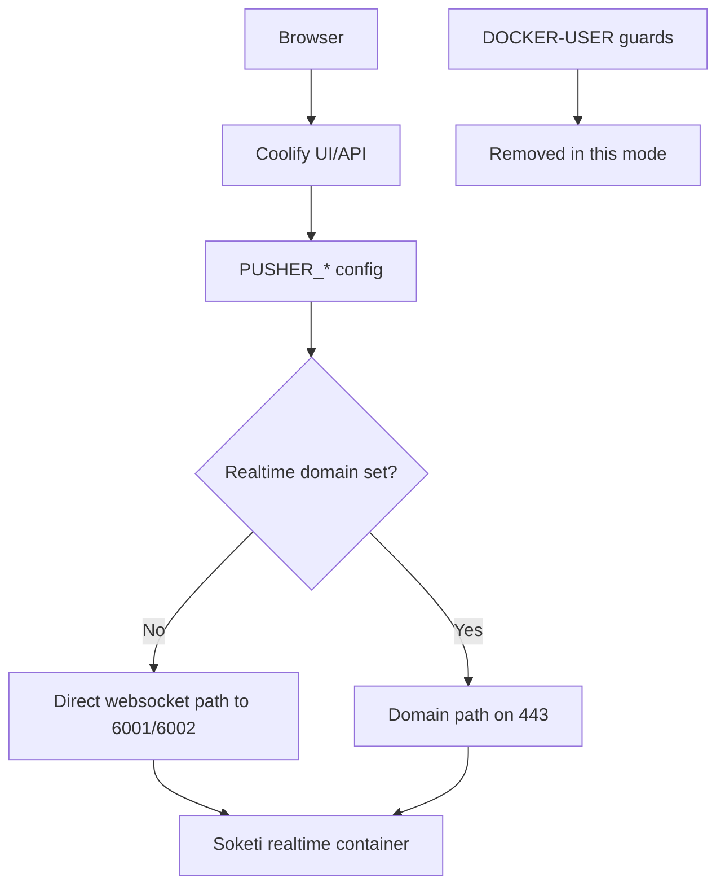
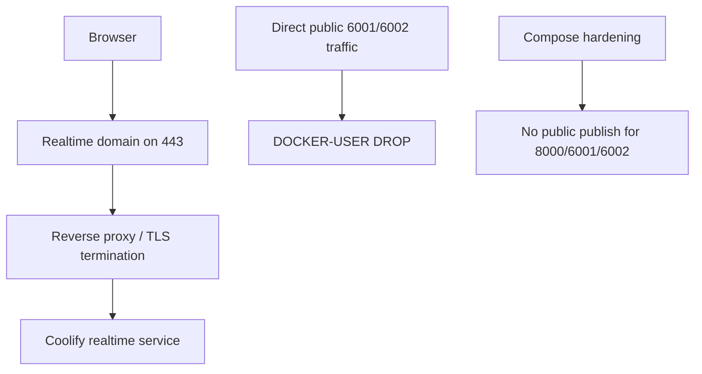

---
---

# VPS Coolify Realtime Modes

This page explains exactly how realtime works for:
- `CLOSE_COOLIFY_REALTIME_PORTS=false`
- `CLOSE_COOLIFY_REALTIME_PORTS=true`

It also includes operational update procedures and a dedicated script:
`scripts/update-realtime-mode.sh`.

## Realtime variables in scope

- `CLOSE_COOLIFY_REALTIME_PORTS`
  - `false`: keep public publish path for `6001/6002`
  - `true`: block direct public `6001/6002` and enforce domain-based realtime path
- `COOLIFY_REALTIME_DOMAIN`
  - used as `PUSHER_HOST` when set
  - optional in closed mode; if empty, bootstrap uses `COOLIFY_PUBLIC_DOMAIN` as realtime host

## Mode A: `CLOSE_COOLIFY_REALTIME_PORTS=false`

### Behavior

Bootstrap enforces:
- removes `DOCKER-USER` drop guards for realtime ports
- if `COOLIFY_REALTIME_DOMAIN` is set:
  - writes `PUSHER_HOST=<domain>`
  - writes `PUSHER_PORT=443`
  - writes `PUSHER_SCHEME=https`
- if `COOLIFY_REALTIME_DOMAIN` is empty:
  - removes `PUSHER_HOST`, `PUSHER_PORT`, `PUSHER_SCHEME`

Result:
- direct public access to `6001/6002` may exist via Docker publish rules
- app-level routing can still point to domain `443` when domain is set

### Graph (descriptive)



### Advantages

- simplest setup for initial bring-up
- less dependency on reverse proxy/domain readiness
- faster troubleshooting for raw websocket connectivity

### Risks

- `6001/6002` can be internet-reachable if Docker publishes them
- larger attack surface compared to closed mode
- easy to assume UFW blocks these ports while Docker bypasses UFW paths

### Example

```env
CLOSE_COOLIFY_REALTIME_PORTS=false
COOLIFY_REALTIME_DOMAIN=
```

or

```env
CLOSE_COOLIFY_REALTIME_PORTS=false
COOLIFY_REALTIME_DOMAIN=realtime.example.com
```

## Mode B: `CLOSE_COOLIFY_REALTIME_PORTS=true`

### Behavior

Bootstrap enforces:
- resolves effective realtime domain:
  - `COOLIFY_REALTIME_DOMAIN` when set (non-placeholder)
  - otherwise `COOLIFY_PUBLIC_DOMAIN`
- writes `PUSHER_HOST=<effective-domain>`, `PUSHER_PORT=443`, `PUSHER_SCHEME=https`
- hardens Coolify compose files:
  - removes canonical `8000->8080` publish rules
    (`${APP_PORT:-8000}:8080` / `8000:8080`) in base/prod compose files
  - converts Soketi public `ports` into internal `expose` in `docker-compose.prod.yml`
- adds `DOCKER-USER` guards to drop public forwarded traffic to `6001/6002`
  with localhost/private network allow exceptions

Result:
- direct public `6001/6002` ingress is blocked by compose hardening + `DOCKER-USER`
- realtime must flow through domain/reverse-proxy path on `443`

### Graph (descriptive)



### Advantages

- reduced external attack surface
- deterministic ingress path through `80/443`
- easier policy enforcement and security review

### Risks

- depends on correct DNS and reverse-proxy readiness
- broken TLS/domain config can cause realtime failures
- stricter mode; misconfigured domain causes immediate service issues

### Example

```env
CLOSE_COOLIFY_REALTIME_PORTS=true
COOLIFY_REALTIME_DOMAIN=realtime.example.com
```

or reuse the same domain:

```env
CLOSE_COOLIFY_REALTIME_PORTS=true
COOLIFY_REALTIME_DOMAIN=
COOLIFY_PUBLIC_DOMAIN=hub.example.com
```

## Update procedure for each mode

Use the dedicated script on the VPS:

`scripts/update-realtime-mode.sh`

It:
1. updates server `bootstrap.env`
2. validates mode/domain combination
3. runs bootstrap replay to apply policy (unless `--no-replay`)

### Switch to public mode (domain cleared)

```bash
sudo bash /opt/vps-coolify-bootstrap/scripts/update-realtime-mode.sh \
  --mode public \
  --clear-domain
```

### Switch to public mode (keep domain routing)

```bash
sudo bash /opt/vps-coolify-bootstrap/scripts/update-realtime-mode.sh \
  --mode public \
  --domain realtime.example.com
```

### Switch to closed mode

```bash
sudo bash /opt/vps-coolify-bootstrap/scripts/update-realtime-mode.sh \
  --mode closed \
  --domain realtime.example.com
```

### Switch to closed mode (reuse `COOLIFY_PUBLIC_DOMAIN`)

```bash
sudo bash /opt/vps-coolify-bootstrap/scripts/update-realtime-mode.sh \
  --mode closed
```

### Update only env (apply later)

```bash
sudo bash /opt/vps-coolify-bootstrap/scripts/update-realtime-mode.sh \
  --mode closed \
  --domain realtime.example.com \
  --no-replay
```

Then apply later:

```bash
sudo bash /opt/vps-coolify-bootstrap/scripts/bootstrap-host.sh /etc/vps-coolify-bootstrap/bootstrap.env
```

## Post-update verification

```bash
sudo grep -nE '^CLOSE_COOLIFY_REALTIME_PORTS=|^COOLIFY_REALTIME_DOMAIN=' /etc/vps-coolify-bootstrap/bootstrap.env
sudo grep -nE '^PUSHER_(HOST|PORT|SCHEME)=' /data/coolify/source/.env
sudo iptables -S DOCKER-USER | grep -E '6001|6002' || true
sudo ip6tables -S DOCKER-USER 2>/dev/null | grep -E '6001|6002' || true
sudo ss -lntp | grep -E ':(80|443|8000|6001|6002)\b' || true
sudo bash /opt/vps-coolify-bootstrap/scripts/verify-bootstrap-state.sh /etc/vps-coolify-bootstrap/bootstrap.env
```

Interpretation:
- closed mode expected: `6001/6002` not publicly published, guards present
- public mode expected: guards removed; published ports may exist

Back to [Docs Home](index.md)
